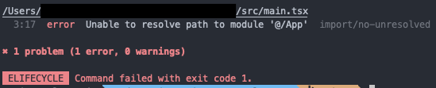

This repo gives a reproduction of the issue described here: https://github.com/import-js/eslint-import-resolver-typescript/issues/94

`tsconfig.json` has a `references` entry, which includes two other tsconfigs.

A `path` alias is set in `tsconfig.app.json` and it works: editor go-to-source, dev server and build are all successful.

However, eslint-import-resovler-typescript does not seem to evaluate it.  

Note that when specificly including all `tsconfig.*.json` files as `projects` it does work. (Uncomment line 14 in `eslint.config.js` to see the issue disappear).  
But this is not ideal when creating a shared config.
